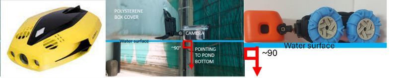

# Computer Vision for Aquaculture Monitoring Robot: Counting and Length Measurement

This repository contains the complete implementation and analysis framework for computer vision algorithms designed for aquaculture monitoring robots, specifically focused on **prawn counting** and **length measurement** in underwater environments.

## 🎯 Research Overview

This project is part of a Master's thesis investigating computer vision applications in aquaculture monitoring. The research addresses two critical challenges:

1. **Automated Prawn Counting**: detection based coutning in aquaculture pond
2. **Precise Length Measurement**: Automated length analysis of giant freshwater prawn

## 🛠️ Platforms 



*Overview of the platforms used in this research project*


*Demonstration of the car used in the length measurement part*

## 📁 Project Structure

```
counting_research_algorithms/
├── 📊 exported_datasets/           # Complete FiftyOne datasets for analysis
│   ├── body_all/                   # 71 images with pose estimation & body 
│   ├── carapace_all/               # 71 images with carapace-specific 
│   ├── exuviae_keypoints/          # 144 images for molting analysis
│   └── prawn_counting/             # 675 images for population counting
├── 🔬 fifty_one and analysis/      # Interactive analysis framework
│   ├── counting/                   # Prawn counting analysis tools
│   └── measurements/               # Length measurement analysis
├── 🚀 colab_notebook/              # Google Colab training notebooks
├── 📈 training and val output/     # Model training outputs and validation results
├── 📋 archived_spreadsheets/       # Analysis results and processed data not used
└── 📚 archived_code_notebooks/     # Historical analysis notebooks
```

## 🚀 Quick Start

### Prerequisites

1. **Install Python dependencies**:
   ```bash
   pip install -r requirements.txt
   ```

2. **Install FiftyOne** (for interactive analysis):
   ```bash
   pip install fiftyone
   ```

3. **Setup Google Colab** (for training):
   - Add API keys to Colab secrets (see `colab_notebook/README.md`)
   - Access training notebooks via Colab

### Running Analysis

#### Interactive Dataset Exploration
```bash
# Launch counting analysis
cd "fifty_one and analysis/counting/"
python run_fiftyone_counting.py

# Launch measurement analysis
cd "fifty_one and analysis/measurements/imagej/"
python run_fiftyone_body.py

or 
python run_fiftyone_carapace.py

#lunch exuviae analysis
cd "fifty_one and analysis/measurements/exuviae"
python run_exuviae_fiftyone.py


```

#### Model Training (Google Colab)
1. Open `colab_notebook/prawn_keypoint_detection_yolov8_colab.ipynb`
2. Setup API keys in Colab secrets
3. Run all cells for automated training

## 📊 Datasets

### 1. Body Measurement Dataset (`body_all/`)
- **71 images** with comprehensive body measurements
- **4 keypoints**: start_carapace, eyes, rostrum, tail
- **6 measurement lines**: max, mid, min diagonals resembling the manual imagej measurement
- **Environmental metadata**: pond info, lighting, height measurements

### 2. Carapace Measurement Dataset (`carapace_all/`)
- **71 images** with carapace-focused measurements
- **Identical structure** to body_all but specialized for carapace analysis
- **Same pose estimation framework** with 4 keypoints

### 3. Exuviae Keypoints Dataset (`exuviae_keypoints/`)
- **144 images** of prawn molted shells
- **Keypoint annotations** with 4-point skeleton
- **Custom polylines** for specialized measurements
- **Bounding box detections** for object localization

### 4. Prawn Counting Dataset (`prawn_counting/`)
- **675 images** - largest dataset for population analysis
- **Detection annotations**: Ground truth and model predictions
- **Evaluation metrics**: True positives, false positives, false negatives
- **COCO-style evaluation** with IoU thresholds

### External Dataset Sources
- **[Giant Freshwater Prawn Keypoint Detection](https://universe.roboflow.com/prawns/giant-freshwater-prawn-keypoint-detection-umvh3/dataset/97)**: Roboflow annotated dataset for pose estimation and keypoint detection
- **[Giant Freshwater Prawns Counting](https://universe.roboflow.com/prawns/giant-freshwater-prawns-counting)**: Roboflow annotated dataset for prawn counting and detection
- **[Measurement Videos](https://www.dropbox.com/scl/fo/trqlm4vmtv8jvnp0elfwk/AE4zGySEXogXVy-wM3gV-Qg?rlkey=nf5ux0akhgvk4zh8d8w8i9wxn&st=wkb86tkv&dl=0)**: Raw videos for the measurements application
- **[Detection Videos & Images](https://www.dropbox.com/scl/fo/driniq5l5vxs3m0ierda7/ABYKsrhaldHocoy3i4155gg?rlkey=bchfanv8mceqvjnaroa32fxms&st=r0fhfjhi&dl=0)**: Raw videos for the counting application
- **[Exuviae Images](https://1drv.ms/f/c/d7017e80123f7d82/EoJ9PxKAfgEggNdkaQUAAAABdT9z8ut3lTr-Lw6qfs8G0w?e=bszuZj)**: Collection of exuviae (molted prawn shells) images for length validation analysis after preprocessing the videos

## 🔬 Analysis Framework

### FiftyOne Integration
The project uses **FiftyOne** for comprehensive dataset management and analysis:

- **Interactive Visualization**: Web-based interface for data exploration
- **Multi-Modal Analysis**: Support for counting, measurement, and exuviae analysis
- **Automated Validation**: Compare predictions with ground truth
- **Error Analysis**: Comprehensive metrics and visualization
- **Scalable Architecture**: Handle large-scale datasets efficiently

### Counting Analysis Interface


*Interactive FiftyOne interface for prawn counting analysis and evaluation*

### Measurement Analysis Examples


*Example of automated total length measurement with keypoint detection*


*Comparison of automated carapace length measurements with ground truth data (red line- and its' data)*

### Exuviae Analysis Interface for two prawns (big and small)


*FiftyOne interface for exuviae (molted shells) analysis and keypoint detection*


*Measurement results and analysis for exuviae sample, showing the pred length of the prawn (187mm) the grount truth is 180*


### Key Analysis Capabilities

1. **Counting Analysis**:
   - YOLO-based detection model evaluation
   - Multi-threshold confidence analysis
   - Performance metrics and error analysis

2. **live prawns Measurement Analysis**:
   - Automated length measurement validation
   - Body and carapace size analysis
   - Environmental factor correlation

3. **Exuviae length Analysis**:


## 🤖 Model Training

### YOLOv11 Pose Estimation
- **Purpose**: Train keypoint detection models for precise measurements
- **Environment**: Google Colab with GPU acceleration
- **Features**:
  - Secure API key management using Colab secrets
  - Custom W&B callback for advanced logging
  - Automated dataset downloading from Roboflow
  - Optimized hyperparameters for prawn detection

### Training Outputs
All training results are stored in `training and val output/`:
- **Validation runs**: Model performance on validation data
- **Prediction runs**: Test results on unseen data
- **Label files**: YOLO format annotations
- **Performance metrics**: Detailed evaluation results

### Pre-trained Model Weights
- **🛠 Object Detection (Counting)**: [Model weights for prawn object detection](https://drive.google.com/drive/folders/1KJ1FOhahT8TRm1uN4n8PedH_XHyj0UDV?usp=sharing)
- **🧠 Keypoint Detection (Measurement)**: [Model weights for pose estimation](https://drive.google.com/drive/folders/1ioh-IC-7wVVUydyJIQqEKEEHEaK9d7gP?usp=drive_link)

## 📈 Key Features

### Computer Vision Capabilities
- **Object Detection**: YOLO-based prawn detection in underwater imagery
- **Pose Estimation**: 4-point keypoint detection for precise measurements

### Research Applications
- **Population Monitoring**: Automated counting for aquaculture management
- **Growth Tracking**: Precise length measurements for growth studies
- **Exuviae Analysis**: used for length validation

### Data Quality
- **Undistorted Images**: Camera calibration and distortion correction
- **Gamma Correction**: Optimized lighting for underwater conditions
- **Environmental Metadata**: Comprehensive recording of conditions
- **Validation Metrics**: Quantitative performance evaluation

## 🛠️ Technical Stack

### Core Dependencies
- **FiftyOne** (1.6.0): Dataset management and visualization
- **OpenCV** (4.11.0.86): Computer vision processing
- **TensorFlow** (≥2.19.0): Deep learning framework
- **Ultralytics**: YOLO model training and inference
- **NumPy** (≥1.26.0): Numerical computations
- **Pandas** (≥2.2.0): Data manipulation and analysis

### Visualization & Analysis
- **Matplotlib** (≥3.9.0): Plotting and visualization
- **Seaborn** (≥0.13.0): Statistical visualizations
- **Plotly** (≥5.18.0): Interactive plots
- **Jupyter** (≥1.0.0): Interactive notebooks

## 📚 Documentation

### Detailed Guides
- **`colab_notebook/README.md`**: Complete training setup and workflow
- **`exported_datasets/README.md`**: Dataset descriptions and usage
- **`fifty_one and analysis/README.md`**: Analysis framework overview
- **`training and val output/README.md`**: Model training outputs

### Subdirectory Documentation
- **Counting Analysis**: `fifty_one and analysis/counting/README.md`
- **Measurement Analysis**: `fifty_one and analysis/measurements/README.md`
- **Data Processing**: `fifty_one and analysis/measurements/data_processing_scripts/README.md`

## 🔍 Research Contributions

### Novel Approaches
1. **Mobile Platform for Artificial Ponds**: Development of computer vision algorithms specifically designed for mobile monitoring platforms in artificial aquaculture ponds
2. **Exuviae as Length Validation**: Novel use of molted prawn shells (exuviae) as a validation method for length measurement accuracy
3. **Floating Platform for Scale Maintenance**: Implementation of floating platforms to maintain consistent scale and improve measurement precision

### Practical Applications
- **Aquaculture Management**: Automated population monitoring
- **Growth Studies**: Precise morphometric analysis
- **Research Tools**: Comprehensive analysis framework for aquaculture research
- **Robot Integration**: Algorithms designed for autonomous monitoring systems

## 🤝 Usage Guidelines

### For Researchers
1. **Dataset Access**: Use `exported_datasets/` for pre-processed datasets
2. **Analysis Tools**: Leverage FiftyOne framework for interactive analysis
3. **Model Training**: Follow Colab notebook for reproducible training
4. **Customization**: Modify hyperparameters and configurations as needed

### For Developers
1. **Code Structure**: Follow existing patterns for consistency
2. **Documentation**: Update README files when adding new features
3. **Testing**: Use validation datasets for model evaluation
4. **Integration**: Design for robot deployment and real-time processing

## 📄 License

This project is licensed under the **Creative Commons Attribution-NonCommercial 4.0 International License (CC BY-NC 4.0)**.

**What this means:**
- ✅ **Research & Academic Use**: Free to use for research and educational purposes
- ✅ **Modification & Distribution**: Can adapt and share the work
- ❌ **Commercial Use**: Cannot use for commercial purposes without permission
- 📝 **Attribution Required**: Must give proper credit to the original author

For full license details, see the [`LICENSE`](LICENSE) file. For commercial licensing inquiries, please contact the copyright holder.

## 🙏 Acknowledgments

This research was conducted as part of a Master's thesis in computer vision for aquaculture applications. The project builds upon advances in deep learning, computer vision, and aquaculture monitoring technologies.

---

**Note**: This repository contains the complete research implementation, including datasets, analysis tools, training code, and documentation. All components are designed to work together as a comprehensive framework for aquaculture monitoring research. 