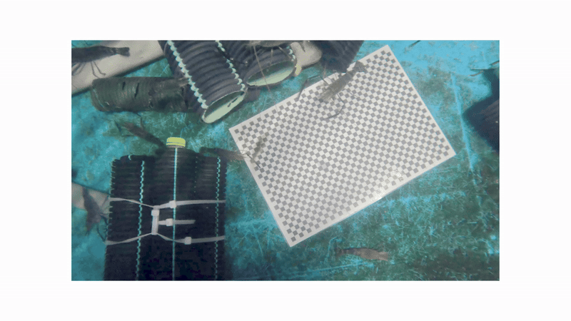

# Data Processing Scripts

## Overview

This directory contains a comprehensive suite of data processing scripts designed for prawn measurement analysis and video processing in underwater research applications. The scripts handle image undistortion, ImageJ measurement data processing, and video-to-dataset conversion with quality filtering.

## Directory Structure

```
data_processing_scripts/
├── README.md                           # This file
├── undistort_images.py                 # GoPro image undistortion
├── gamma_all.py                        # Gamma correction for image enhancement
├── images/                             # Image processing examples and assets
│   └── undistortion.gif               # Visual demonstration of undistortion
├── imagej- data exctraction/           # ImageJ measurement processing
│   ├── 1-prawn_measurement_id_assignment.py
│   └── 2- from imagej-prawn_measurement_statistics.py
└── video_processing/                   # Video processing pipeline
    ├── README.md                       # Detailed video processing documentation
    ├── video2dataset.py                # Main video processing engine
    ├── checkers.py                     # Quality checking algorithms
    ├── parameters.py                   # Configuration management
    └── video_splt_main.py              # Video splitting utility
```

## Scripts Documentation

### 1. Image Processing and Enhancement

#### `undistort_images.py`
**Purpose**: Removes lens distortion from GoPro Hero 11 camera images using camera calibration parameters.

**What I did differently**: I implemented a fisheye camera model specifically calibrated for GoPro Hero 11 using parameters exported from Gyroflow. The script uses `cv2.fisheye.estimateNewCameraMatrixForUndistortRectify()` and `cv2.fisheye.initUndistortRectifyMap()` for accurate undistortion.

**Key Features**:
- Uses GoPro Hero 11 specific camera matrix and distortion coefficients
- Processes entire directories of JPG images
- Maintains image quality with configurable balance and FOV scaling
- Progress tracking with tqdm

**Camera Parameters**:
```python
CAMERA_MATRIX = np.array([
    [3043.621958852673, 0.0, 2525.2907991218367],
    [0.0, 3015.014085286132, 1596.4745000545388],
    [0.0, 0.0, 1.0]
])

DISTORTION_COEFFS = np.array([
    0.2528090891288297,
    0.1324221379663344,
    0.07048721428221141,
    0.1610412047411928
])
```

**Usage**:
```bash
python undistort_images.py
```

**Dependencies**: OpenCV, NumPy, tqdm

#### `gamma_all.py`
**Purpose**: Applies gamma correction to enhance image brightness and contrast for underwater research images and to easily identify carapace

**What I did differently**: I implemented a batch gamma correction system that processes entire folders of images using lookup tables for efficient processing. The script uses `cv2.LUT()` with pre-computed gamma correction tables to enhance underwater images that often suffer from poor lighting conditions.

**Key Features**:
- Batch processing of entire image folders
- Configurable gamma values (default: 2.2 for standard gamma correction)
- Automatic creation of output directories
- Progress tracking with tqdm
- Efficient lookup table-based gamma correction

**Gamma Correction Algorithm**:
```python
def adjust_gamma(image, gamma=2.2):
    # Build lookup table for gamma correction
    table = np.array([((i / 255.0) ** (1.0 / gamma)) * 255 
                     for i in np.arange(0, 256)]).astype("uint8")
    # Apply correction using LUT for efficiency
    return cv2.LUT(image, table)
```

**Processing Workflow**:
1. Scans input folder for all image files
2. Applies gamma correction using lookup table optimization
3. Creates `gamma/` subdirectory for output
4. Saves processed images with `_gamma.jpg` suffix
5. Maintains original file structure

**Usage**:
```bash
python gamma_all.py
```

**Dependencies**: OpenCV, NumPy, tqdm, glob, os




*Animation showing the transformation from distorted GoPro fisheye images to corrected rectilinear image

---

### 2. ImageJ Measurement Processing

#### `imagej- data exctraction/1-prawn_measurement_id_assignment.py`
**Purpose**: First step in prawn measurement analysis pipeline - assigns consistent prawn IDs across multiple measurement datasets.

**What I did differently**: I implemented a spatial proximity matching algorithm that uses bounding box coordinates and measurement angles to match corresponding prawns across different measurement sessions. The system applies pixel-to-mm scale calibration and uses `cv2.matchTemplate()` for visual verification.

**Processing Steps**:
1. Loads measurement data from three separate ImageJ output files
2. Extracts and applies pixel-to-mm scale calibration
3. Matches corresponding prawn measurements using spatial proximity
4. Assigns consistent IDs to matched measurements
5. Saves processed data with assigned IDs

**Key Functions**:
- `extract_scale()`: Extracts calibration scale from measurement data
- `adjust_bounding_box()`: Converts pixel coordinates to real-world measurements
- `find_closest_bbox()`: Matches prawns across datasets using spatial proximity
- `assign_prawn_ids_manually()`: Assigns consistent IDs with visual verification

**Input Files**:
- `1_Full_body.xlsx`
- `2_Full_body.xlsx` 
- `3_Full_body.xlsx`

**Output Files**:
- `final_full_data_1_with_prawn_ids.xlsx`
- `final_full_data_2_with_prawn_ids.xlsx`
- `final_full_data_3_with_prawn_ids.xlsx`

#### `imagej- data exctraction/2- from imagej-prawn_measurement_statistics.py`
**Purpose**: Second step in prawn measurement analysis - calculates statistical metrics and from multiple measurement datasets.

**What I did differently**: I implemented a comprehensive statistical analysis system that merges data from three measurement sessions. The system handles missing data gracefully and provides detailed statistical summaries.

**Key Features**:
- Merges measurement data from three separate datasets
- Filters for measurements present in all datasets
- Processes bounding box coordinates and angles
- Handles scale calibration data

**Statistical Calculations**:
```python
avg_length = np.mean(lengths)


**Input Files**:
- `final_full_data_1_with_prawn_ids.xlsx`
- `final_full_data_2_with_prawn_ids.xlsx`
- `final_full_data_3_with_prawn_ids.xlsx`

**Output File**:
- `final_full_statistics_with_prawn_ids_and_uncertainty.xlsx`

---

### 3. Video Processing Pipeline

#### `video_processing/` Directory
**Purpose**: Comprehensive video processing system for extracting high-quality frames from underwater research videos.

**What I did differently**: I implemented a multi-stage quality filtering pipeline that combines blur detection (Laplacian variance), similarity checking (optical flow), and black frame detection (luminance analysis) to ensure only high-quality, distinct frames are extracted.

**Key Components**:

##### `video2dataset.py` - Main Processing Engine
- **Core Class**: `Video2Dataset` orchestrates the entire video-to-dataset conversion
- **Frame Processing Pipeline**: Resize → Blur detection → Black frame detection → Similarity detection
- **Quality Filtering**: Uses three specialized checkers for comprehensive quality control

##### `checkers.py` - Quality Checking Algorithms
- **ThresholdBlurChecker**: Uses Laplacian variance for blur detection
- **SimilarityChecker**: Implements optical flow-based similarity detection
- **BlackFrameChecker**: Two-pass luminance analysis for black frame detection

##### `parameters.py` - Configuration Management
- Centralizes all processing parameters
- Automatic directory creation
- Input validation and default values

##### `video_splt_main.py` - Video Splitting Utility
- Splits large videos into manageable segments
- Maintains processing efficiency

**Key Features**:
- Intelligent frame extraction with quality filtering
- Multi-quality checks (blur, similarity, black frames)
- Batch processing support
- Statistical logging and reporting
- Configurable parameters
- EXIF metadata preservation

**Usage**:
```bash
cd video_processing/
python video2dataset.py --input video.mp4 --output frames/
```

**Dependencies**: OpenCV, NumPy, tqdm, pandas

---

## Installation and Setup

### Prerequisites
```bash
pip install opencv-python numpy pandas tqdm matplotlib
```

### Directory Setup
```bash
# Create necessary directories
mkdir -p input_images output_images
mkdir -p video_processing/input video_processing/output
```

## Usage Workflow

### 1. Image Processing Workflow
```bash
# Step 1: Undistort images
python undistort_images.py

# Step 2: Apply gamma correction for enhanced visibility
python gamma_all.py

# Step 3: Process ImageJ measurements
cd "imagej- data exctraction"
python 1-prawn_measurement_id_assignment.py
python 2- from imagej-prawn_measurement_statistics.py
```

### 2. Video Processing Workflow
```bash
cd video_processing/
python video2dataset.py --input video.mp4 --output frames/
```

## Output Files

### Image Processing Outputs
- **Undistorted Images**: `undistorted_*.jpg` files with lens distortion removed
- **Gamma Corrected Images**: `*_gamma.jpg` files with enhanced brightness and contrast
- **Visual Demonstrations**: `undistortion.gif` showing before/after undistortion comparison
- **Measurement Data**: Excel files with assigned prawn IDs and statistical analysis
- **Statistical Reports**: Consolidated measurement statistics with uncertainties

### Video Processing Outputs
- **Extracted Frames**: High-quality JPG frames with EXIF metadata
- **Processing Statistics**: CSV files with detailed processing logs
- **Quality Metrics**: Blur scores, similarity measures, and frame statistics

## Technical Details

### Camera Calibration
The undistortion script uses GoPro Hero 11 specific parameters obtained from Gyroflow calibration:
- **Resolution**: 5312x2988 pixels
- **Focal Length**: ~3043px (horizontal), ~3015px (vertical)
- **Principal Point**: (2525, 1596)
- **Distortion Model**: Fisheye with 4 coefficients

### Quality Metrics
- **Blur Detection**: Laplacian variance threshold (default: 100)
- **Similarity Detection**: Optical flow distance threshold (default: 30)
- **Black Frame Detection**: Luminance-based with adaptive thresholds

### Statistical Analysis
- **Data Filtering**: Only measurements present in all datasets
- **Scale Calibration**: Pixel-to-mm conversion from calibration measurements

## Troubleshooting

### Common Issues
1. **Memory Errors**: Reduce `internal_resolution` in video processing
2. **Poor Quality Frames**: Adjust blur and similarity thresholds
3. **Missing Measurements**: Check ImageJ output file formats
4. **Undistortion Artifacts**: Adjust balance and FOV scale parameters


## Dependencies Summary

- **OpenCV**: Image and video processing
- **NumPy**: Numerical computations
- **Pandas**: Data manipulation and Excel I/O
- **tqdm**: Progress tracking
- **Matplotlib**: Visualization (optional)
- **OS**: File system operations 