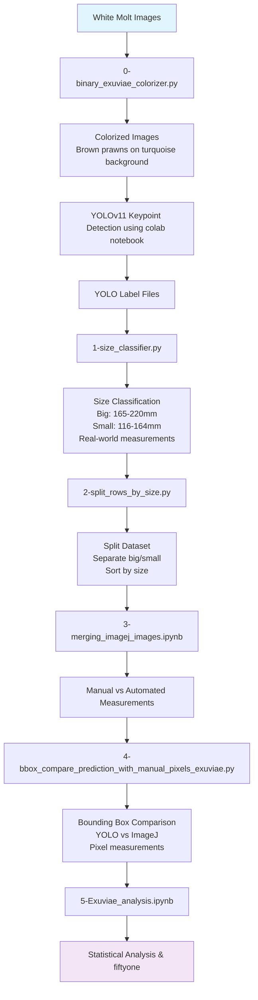
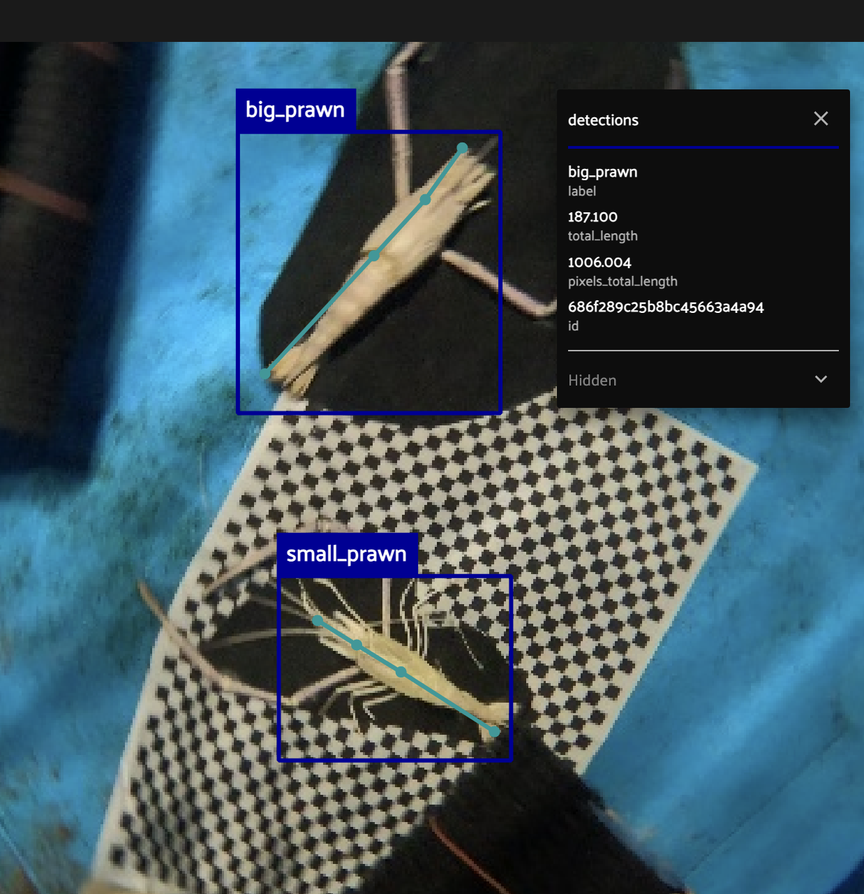

# Exuviae Measurement Analysis

## Overview

This directory contains a comprehensive suite of tools for analyzing prawn exuviae (molted shells) measurements using computer vision techniques and the FiftyOne dataset management platform. The analysis pipeline processes images of white prawn molts, applies realistic coloring for better detection, performs keypoint detection, and calculates real-world measurements.

## Directory Structure

```
exuviae/
├── README.md                           # This documentation file
├── 0-binary_exuviae_colorizer.py      # Image preprocessing and colorization
├── 1-size_classifier.py               # Size classification 
├── 2-split_rows_by_size.py            # row splitting by size category
├── 3-merging_imagej_images.ipynb      # Jupyter notebook for merging images from imagej
├── 4-bbox_compare_prediction_with_manual_pixels_exuviae.py  # Bounding box comparison between pixel measurement and predicted
├── 5-Exuviae_analysis.ipynb           # Main analysis notebook
├── create_fiftyone_exuviae_keypoints_dataset.py  # FiftyOne dataset creation
├── run_exuviae_fiftyone.py            # FiftyOne execution script
├── .DS_Store                          # macOS system file
├── archived/                          # not used scripts and data
├── spreadsheet_files/                 # Analysis results and data
│   ├── length_analysis_new_split.csv
│   ├── length_analysis_new_split_shai_exuviae.csv
│   ├── length_analysis_new_split_shai_exuviae_with_yolo.csv
│   └── Results-shai-exuviae.csv

```

## Analysis Pipeline Flow



**Ground Truth Values:**
- Big Exuviae: 180mm (18cm)
- Small Exuviae: 145mm (14.5cm)

**Error Metrics:**
- MAE (Mean Absolute Error)
- MAPE (Mean Absolute Percentage Error)
- Position Error Analysis
- Scale Impact Analysis

## Core Components

### 1. Binary Molt Colorizer (`0-binary_exuviae_colorizer.py`)

**Purpose**: Processes images of white prawn molts (exuviae) by applying realistic coloring to make them look like actual prawns.

**Key Features**:
- Binary thresholding to identify white molts against dark backgrounds
- Applies realistic prawn coloring (brown) to the molt
- Turquoise background for contrast
- Batch processing support for entire folders
- Progress tracking with tqdm
- Extensive error handling

**What it does**: Uses a simple but effective approach that identifies the white molt against the dark background using binary thresholding, then applies natural prawn coloring for better detection.

**Technical Details**:
- Uses fixed threshold value of 60 (determined empirically)
- Molt areas (originally white): Brown [79, 66, 52] in BGR to match real prawn color
- Background (originally dark): Turquoise [31, 156, 212] for contrast
- Processes images with "segmented_" prefix in output folder

**Usage**:
```python
python 0-binary_exuviae_colorizer.py
```

**Author**: Gil Benor  
**Date**: March 4, 2024

### 2. Size Classifier (`1-size_classifier.py`)

**Purpose**: Provides functionality for analyzing measurements of prawn exuviae (molted shells) from image detections.

**Key Features**:
- Converts pixel coordinates to real-world measurements (millimeters)
- Categorizes detections into size classes (big: 165-220mm, small: 116-164mm)
- Handles different image heights and camera configurations
- Processes multiple detections per image
- Saves analysis results to CSV

**Core Class**: `ObjectLengthMeasurer`
- Converts pixel measurements to real-world distances based on camera parameters
- Handles conversion of pixel coordinates to real-world measurements (in millimeters)
- Takes into account camera field of view, image dimensions, and distance to subject

**What it does**: Uses trigonometry to determine how many millimeters each pixel represents based on the camera's field of view (FOV), the distance to the subject, and the image dimensions.

**Dependencies**:
- pandas: For data manipulation and CSV handling
- numpy: For numerical operations
- pathlib: For file path handling
- tqdm: For progress tracking

### 3. Dataset Splitting Utility (`2-split_rows_by_size.py`)

**Purpose**: Transforms analysis data from a CSV file by splitting rows based on lobster size.

**What it does**: Reads a CSV file containing analysis data of lobsters, processes each row to separate data for big and small lobsters, and saves the transformed data into a new CSV file.

**Key Features**:
- Checks for existence of data for each lobster size
- Creates separate rows for big and small lobsters in the new dataframe
- Sorts the new dataframe by image_name and lobster_size
- Handles missing data gracefully

### 4. Bounding Box Comparison (`4-bbox_compare_prediction_with_manual_pixels_exuviae.py`)

**Purpose**: Compares predicted bounding boxes from YOLOv11 keypoint outputs with ImageJ-measured pixel lengths

**Process for each image**:
1. Load the YOLO label file corresponding to that image
2. Select the prediction with the largest bounding-box area (in pixels)
3. Convert its normalized (x_center, y_center, width, height) values to absolute pixel coordinates
4. Store the resulting BX_pred, BY_pred, Width_pred, Height_pred values
5. Compute their absolute differences from the ImageJ BX, BY, Width, Height
6. Save a CSV alongside the original measurements

**What it does differently**: Aware of the YOLOv11 keypoint label format and keeps all keypoint information needed for extracting rostrum and tail locations later.

**Usage**:
```bash
python scripts/bbox_compare_shai_exuviae.py
```

### 5. FiftyOne Dataset Creation (`create_fiftyone_exuviae_keypoints_dataset.py`)

**Purpose**: Processes prawn keypoint data using the FiftyOne library.

**Key Features**:
- Loads image and label data
- Processes keypoints from YOLO format into FiftyOne format
- Creates a dataset for visualization and analysis
- Handles both predicted and ground truth keypoints
- Calculates distances between keypoints
- Matches them with ground truth data from a CSV file
- Exports the dataset for further use
- Provides options to view the dataset in a web app

**What it does differently**: Designed to work with specific directory structures and file naming conventions, includes error handling for missing files and data inconsistencies.

### 6. FiftyOne Execution Script (`run_exuviae_fiftyone.py`)

**Purpose**: Manages and visualizes a dataset of prawn keypoints using the FiftyOne library.

**Key Steps**:
1. Define the path to the exported dataset directory
2. Check for and delete any existing dataset named 'prawn_keypoints'
3. Load the dataset from the specified directory
4. Print the number of samples and the dataset's field schema
5. Launch the FiftyOne app for dataset visualization

**What it does differently**: Attempts to load an existing dataset from a specified directory, deletes any pre-existing dataset with the same name to ensure a fresh start, and launches the FiftyOne app to provide a graphical interface for exploring the dataset.


## Data Flow

1. **Image Preprocessing**: White molt images are colorized using binary thresholding
2. **Keypoint Detection**: YOLO models detect keypoints on colorized images
3. **Measurement Calculation**: Pixel coordinates converted to real-world measurements using trigonometric scaling
4. **Dataset Creation**: FiftyOne datasets created for visualization and analysis
5. **Analysis**: Statistical analysis and visualization generation
6. **Results**: Spreadsheet files contain processed measurements and analysis results

## Example Results

### FiftyOne Dataset Visualization

The analysis pipeline produces a comprehensive FiftyOne dataset for interactive exploration. The interface shows:

- **144 samples** of prawn exuviae with keypoint detections
- **Multiple annotation types**:
  - Keypoints (teal/cyan): Anatomical points for measurement
  - Detections (blue): Bounding boxes around prawns
  - Manual annotations (purple): imagej pixel measurements
- **Real-time filtering** and metadata exploration
- **Grid view** of all processed images

### Detection and Measurement Example

The system successfully detects and measures prawns with high accuracy:

- **Big Prawn Detection**:
  - Total length: 187.100mm
  - Pixel length: 1006.004 pixels
  - Bounding box classification: "big_prawn"
  
- **Small Prawn Detection**:
  - Accurate size classification
  - Precise keypoint placement
  - Real-world measurement conversion




## Key Measurements

### Ground Truth Values
The analysis uses specific ground truth measurements for error calculation:
- **Big Exuviae Ground Truth**: 180mm total length (18cm)
- **Small Exuviae Ground Truth**: 145mm total length (14.5cm)

### Size Classes
- **Big Exuviae**: 165-220mm total length (Ground Truth: 180mm)
- **Small Exuviae**: 116-164mm total length (Ground Truth: 145mm)

### Keypoint Measurements
- **Total Length**: Distance from rostrum to tail
- **Carapace Length**: Distance from start of carapace to eyes
- **Body Length**: Distance from eyes to tail

## Dependencies

```python
# Core dependencies
pandas>=1.3.0
numpy>=1.21.0
opencv-python>=4.5.0
fiftyone>=0.14.0
PIL>=8.0.0
tqdm>=4.62.0

# Visualization
matplotlib>=3.5.0
seaborn>=0.11.0
plotly>=5.0.0

# Jupyter
jupyter>=1.0.0
ipykernel>=6.0.0
```

## Usage Examples

### Basic Measurement Analysis
```python
from size_classifier import ObjectLengthMeasurer, analyze_good_detections

# Initialize measurer with camera parameters
measurer = ObjectLengthMeasurer(
    image_width=1920,
    image_height=1080,
    horizontal_fov=82.5,
    vertical_fov=82.5,
    distance_mm=700
)

# Run analysis
analyze_good_detections()
```

### FiftyOne Dataset Creation
```python
python create_fiftyone_exuviae_keypoints_dataset.py
```

### Image Colorization
```python
python 0-binary_exuviae_colorizer.py
```

## Output Files

### Spreadsheet Files
- `length_analysis_new_split.csv`: Main measurement results
- `Results-shai-exuviae.csv`: Shai's manual measurement data
- `length_analysis_new_split_shai_exuviae.csv`: Combined analysis results

### Visualizations
- Interactive HTML plots for error analysis
- Position error heatmaps and summaries
- Classification statistics and individual image results

## Error Analysis

The analysis includes comprehensive error metrics:
- **MAE (Mean Absolute Error)**: Average absolute difference between predicted and ground truth
- **MAPE (Mean Absolute Percentage Error)**: Percentage error relative to ground truth
- **Position Error Analysis**: Spatial distribution of measurement errors
- **Scale Impact Analysis**: How measurement errors vary with object size

## Contributing

When adding new scripts to this directory:

1. **Use descriptive names**: Script names should clearly indicate their purpose
2. **Add documentation**: Include detailed docstrings and comments
3. **Explain differences**: Document what makes your approach unique
4. **Separate concerns**: Use clear section separators (##########) between different functionalities
5. **Update this README**: Add new components to the documentation

## Notes

- All scripts use absolute paths to avoid path resolution issues
- The analysis is specifically designed for prawn exuviae with white molts on dark backgrounds
- Camera parameters are optimized for the specific imaging setup used in this research
- FiftyOne datasets are exported for persistent storage and sharing 