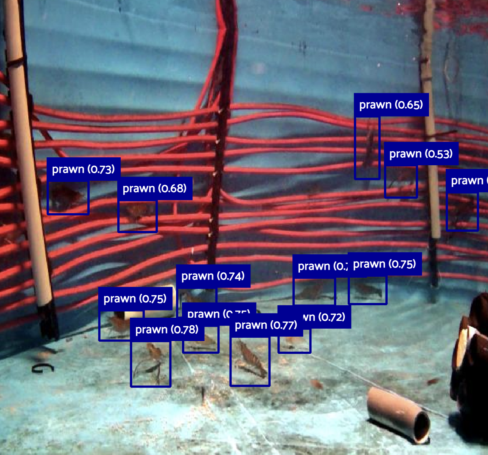

# Prawn Counting Analysis with FiftyOne



This directory contains tools and notebooks for analyzing prawn counting in underwater images using FiftyOne for dataset management and visualization.

## Directory Contents

### Files

- **`run_fiftyone_counting.py`** - Simple script to load and launch the prawn counting dataset in FiftyOne
- **`counting-fiftyone_dataset_creation_and_analysis.ipynb`** - Comprehensive Jupyter notebook for dataset creation, model evaluation, and analysis

## Purpose

This directory focuses on **prawn counting analysis** in underwater imagery, specifically:

1. **Dataset Management**: Creating and managing FiftyOne datasets for prawn counting
2. **Model Evaluation**: Evaluating YOLO-based detection models at multiple confidence thresholds
3. **Visualization**: Interactive exploration of detection results using FiftyOne's web interface
4. **Analysis**: Comprehensive analysis of counting accuracy and model performance

## 🚀 Quick Start

### Prerequisites

1. **Install FiftyOne**:
   ```bash
   pip install fiftyone
   ```

2. **Install additional dependencies**:
   ```bash
   pip install ultralytics pillow pytesseract matplotlib seaborn
   ```

3. **Ensure dataset access**: The scripts expect the prawn counting dataset to be available in `exported_datasets/prawn_counting/`

### Running the Analysis

#### Option 1: Quick Dataset Viewer
```bash
python run_fiftyone_counting.py
```
This will:
- Load the prawn counting dataset from `exported_datasets/prawn_counting/`
- Launch FiftyOne's web interface
- Allow interactive exploration of images and detections

#### Option 2: Comprehensive Analysis
```bash
jupyter notebook counting-fiftyone_dataset_creation_and_analysis.ipynb
```
This notebook provides:
- Complete dataset creation workflow
- Model evaluation at multiple confidence thresholds
- Detailed performance analysis
- Visualization of results

## 📊 Dataset Structure

The prawn counting dataset contains:

- **Images**: Underwater images of prawns in ponds
- **Annotations**: Bounding box detections and ground truth labels
- **Metadata**: Image information and processing details
- **Evaluations**: Model performance metrics

### Expected Dataset Path
```
exported_datasets/prawn_counting/
├── data/           # Image files
├── fields/         # Detection annotations
├── evaluations/    # Model evaluation results
├── samples.json    # Dataset metadata
└── metadata.json   # Dataset configuration
```

## 🔧 Configuration

### Model Configuration
The notebook uses RT-DETR (Real-Time Detection Transformer) for object detection:

```python
CONFIG = {
    'dataset_name': 'circle-pond-analysis',
    'dataset_dir': 'path/to/dataset',
    'model_path': 'path/to/model/weights/best.pt',
    'data_yaml': 'path/to/data.yaml',
    'splits': ["test", "valid", "train"]
}
```

### FiftyOne Configuration
- **Dataset Name**: `prawn_counting`
- **Dataset Type**: `FiftyOneDataset`
- **Auto-deletion**: Existing datasets are automatically deleted before loading

## 📈 Analysis Features

### 1. Multi-Threshold Evaluation
- Evaluates model performance at various confidence thresholds
- Generates precision-recall curves
- Identifies optimal threshold for counting accuracy

### 2. Interactive Visualization
- FiftyOne web interface for image exploration
- Side-by-side comparison of predictions vs ground truth
- Filtering and sorting capabilities

### 3. Performance Metrics
- Mean Average Precision (mAP)
- Counting accuracy
- False positive/negative analysis
- Per-class performance breakdown

## 🛠️ Troubleshooting

### Common Issues

1. **Dataset Not Found**:
   - Ensure `exported_datasets/prawn_counting/` exists
   - Check that `samples.json` is present
   - Verify file permissions

2. **FiftyOne Launch Issues**:
   - Check if port 5151 is available
   - Ensure FiftyOne is properly installed
   - Try restarting the FiftyOne service

3. **Model Loading Errors**:
   - Verify model weights file exists
   - Check YOLO version compatibility
   - Ensure CUDA/GPU drivers are up to date

### Debug Mode
Add debug prints to `run_fiftyone_counting.py`:
```python
print(f"Current directory: {current_dir}")
print(f"Project root: {project_root}")
print(f"Dataset path: {EXPORTED_DATASET_DIR}")
print(f"Path exists: {os.path.exists(EXPORTED_DATASET_DIR)}")
```

## 📚 Related Documentation

- **Parent Directory**: See `../README.md` for general FiftyOne analysis overview
- **Data Access**: See `../DATA_ACCESS.md` for dataset access instructions
- **Measurements**: See `../measurements/` for measurement analysis tools

## 🔗 Dependencies

### Core Libraries
- `fiftyone` - Dataset management and visualization
- `ultralytics` - YOLO model inference
- `numpy` - Numerical computations
- `matplotlib` - Plotting and visualization
- `seaborn` - Statistical visualizations

### Optional Libraries
- `pytesseract` - OCR for text extraction
- `PIL` - Image processing
- `pathlib` - Path manipulation

## 📝 Usage Examples

### Basic Dataset Loading
```python
import fiftyone as fo

# Load dataset
dataset = fo.Dataset.from_dir(
    dataset_dir="exported_datasets/prawn_counting",
    dataset_type=fo.types.FiftyOneDataset,
    name="prawn_counting"
)

# View dataset info
print(f"Dataset size: {len(dataset)} samples")
print(f"Fields: {dataset.get_field_schema()}")
```

### Launch Interactive Viewer
```python
# Launch FiftyOne app
session = fo.launch_app(dataset)
session.wait()
```
